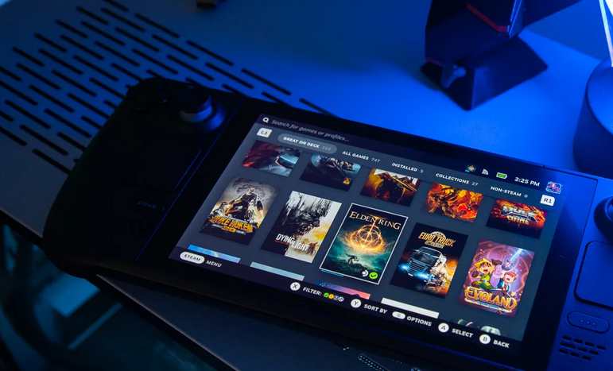
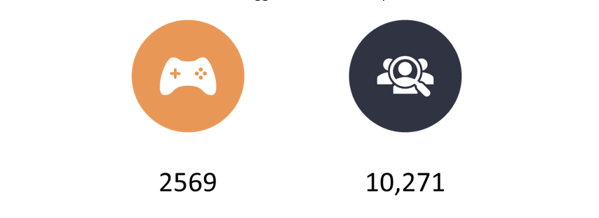
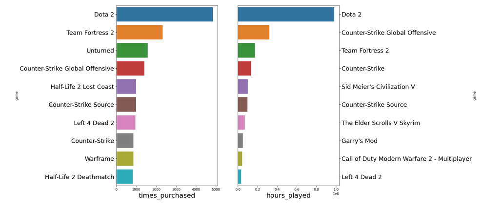
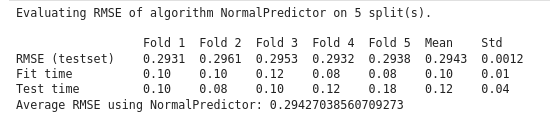
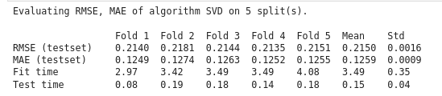
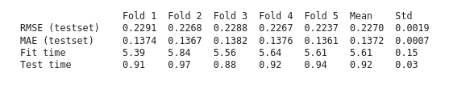
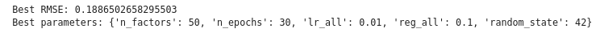
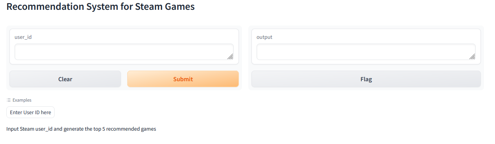

# Steam Games Recommendation System


# 


## Overview

The Steam Game Recommendation System transforms the gaming experience on Steam by utilizing algorithms to analyze user behavior and preferences. Through personalized game recommendations based on collaborative filtering and historical data, the system enhances game discoverability, deepening the connection between users and Steam's extensive game library. This approach not only boosts user satisfaction and engagement but also strategically contributes to revenue growth through targeted recommendations and increased game sales. The system stands as a pioneering force in delivering a tailored and immersive gaming journey, ensuring users find their perfect match in Steam's diverse game catalog.


## Business Understanding

IThe Steam Game Recommendation System aims to enhance user engagement and satisfaction on the Steam gaming platform. By leveraging collaborative filtering techniques, user preferences, and historical gameplay data, the system seeks to provide personalized game recommendations tailored to each user's unique gaming preferences. The primary business goal is to increase game discoverability, leading to higher user retention and increased revenue through game sales. Additionally, the recommendation system contributes to creating a more immersive and enjoyable gaming experience for Steam users by connecting them with titles that align with their interests and gaming habits. Overall, the system aims to foster a stronger connection between gamers and the diverse range of games available on the Steam platform.

## Data Understanding and Preprocessing


The dataset, sourced from Kaggle [Steam Video Games](https://www.kaggle.com/datasets/tamber/steam-video-games/data) with 200k steam user interactions. Between users and how they purchase and play games we end up subsetting the data so that we drop all purchases from the columns and only use games that have been played. After cleaning and and removing ouliers we ended up with 2,569 unique `Games` and 10,271 unique `user_id`.


|  |
| :--: |
| *Plot here is adopted from a Kaggle notebook* 

# Modeling and Evaluation
We are building a Collaboritive Recommendation System with a python package called `surprise` here is a [link](https://surprise.readthedocs.io/en/stable/) to the documentation. So we started with a baseline model using `Normal Predictor` which we will use to compare results to our optimized final model. Through an iterative process we tried a few different models within the surprise library such as `SVD`, `KNNWithMeans`, and `SVD++`. The metrics we used with cross validation to evaluate our models is RMSE (root mean squared error) and MAE (mean absolute error).


#### Normal Predictor 



#### SVD


#### KNNWithMeans


### SVD++ 

#### Final Optimized Model

We used `GridSearchCV` to optimize our final model SVD++ which had the best performance and lowest RMSE and MAE on the testset. Hyperparameters as well as the best RMSE score are provided. 




# Demo 

We built a demo with [Gradio](https://www.gradio.app/) a python package that lets you deploy your machine learning model without any need to write front end code like JS, HTML, or CSS. 

Gradio can be installed with `pip`:

`pip install gradio`

Starter code to run gradio interface straight from your notebook or python script:

```python
import gradio as gr

def greet(name):
    return "Hello " + name + "!"

demo = gr.Interface(
    fn=greet, 
    inputs="text", 
    outputs="text")

demo.launch()
```


Here is the [link](https://2aee7fc06c1f03a3f1.gradio.live/) for our web application to demonstrate 5 top recommendations from our pickled model. You just need to input the `user_id`


## Next Step

In the next phase of the project, users will have the opportunity to input their unique user_id through API calls, enabling the system to provide personalized game recommendations tailored to their gaming preferences. This interactive feature enhances the user experience by delivering targeted suggestions based on individual gaming histories. By leveraging API functionality, the recommendation system ensures a dynamic and user-centric approach, fostering greater engagement and satisfaction within the gaming community.


## Repo Structure

```
├── Images
├── data
├── notebooks
├── .gitignore
├── License
├── README.md
├── Recommendation_System.ipynb -------------> Final Notebook
├── svdpp_model.pkl ---------------->          Final Model
```
## Citations

[Kaggle Notebook](https://www.kaggle.com/code/simonprevoteaux/steam-game-analysis/notebook)
